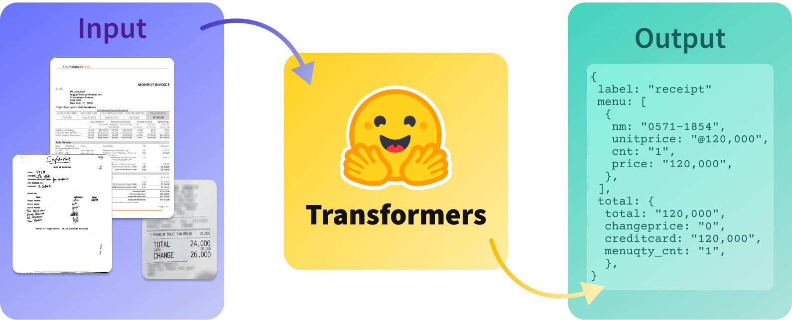

# Document AI with Hugging Face Transformers

[Document AI](https://en.wikipedia.org/wiki/Document_AI) s a term that has become popular over the last 3 years. It defines machine learning models, tasks, and techniques to classify, parse, and extract information from documents in digital and print forms, like invoices, receipts, licenses, contracts, and business reports.

This repository contains different example and tutorials on how to get started with Document AI and Transformers. Below you can also find a compendium of available models, tasks, datasets and other resources.

**Training**
* [fine-tuning donut with SROIE](./training/donut_sroie.ipynb)
* [fine-tuning LayoutLM with FUNSD](./training/layoutlm_funsd.ipynb)
* [fine-tuning LiLT with FUNSD](./training/lilt_funsd.ipynb)

**Inference**
* [Donut](./inference/donut_inference.ipynb)
* [LayoutLM](./inference/layoutlm_inference.ipynb)
* [LiLT](./inference/lilt_inference.ipynb)

**Data-processing**

* [convert FUNSD to donut document for vqa](./data_processing/FUNSD_for_Donut.ipynb)

**Demos/Spaces**

Community: 
* [fedihch/InvoiceReceiptClassifierDemo](https://huggingface.co/spaces/fedihch/InvoiceReceiptClassifierDemo)
* [nielsr/LayoutLMv2-FUNSD](https://huggingface.co/spaces/nielsr/LayoutLMv2-FUNSD)
* [katanaml/LayoutLMv2-CORD](https://huggingface.co/spaces/katanaml/LayoutLMv2-CORD)
* [nielsr/TrOCR-handwritten](https://huggingface.co/spaces/nielsr/TrOCR-handwritten)
* [keras-io/ocr-for-captcha](https://huggingface.co/spaces/keras-io/ocr-for-captcha)
* [nielsr/dit-document-layout-analysis](https://huggingface.co/spaces/nielsr/dit-document-layout-analysis)
* [PatrickTyBrown/LoanDocumentClassifier](https://huggingface.co/spaces/PatrickTyBrown/LoanDocumentClassifier)
* [Theivaprakasham/layoutlmv2_invoice](https://huggingface.co/spaces/Theivaprakasham/layoutlmv2_invoice)
* [TMsp/invoice_processing_layoutlmv3_custom](https://huggingface.co/spaces/Msp/invoice_processing_layoutlmv3_custom)
* [Epoching/DocumentQA](https://huggingface.co/spaces/Epoching/DocumentQA)
* [impira/docquery](https://huggingface.co/spaces/impira/docquery)

popular models are layoutlm.... 
and Donut which we will use today get a first impression of how you can build you own document AI System using Hugging Face Transformers.

### Machine Learning Models (Transformers)

Below you can find a table of the currently available Transformers models, who are achieving state-of-the-art performance on Document AI tasks. 

| model                                                                   | paper                                     | license                                                       | checkpoints                                                 |
|-------------------------------------------------------------------------|-------------------------------------------|---------------------------------------------------------------|-------------------------------------------------------------|
| [Donut](https://huggingface.co/docs/transformers/main/en/model_doc/donut#overview) | [arxiv](https://arxiv.org/abs/2111.15664) | [MIT](https://github.com/clovaai/donut#license) | [huggingface](https://huggingface.co/models?other=donut) |
| [LiLT](https://huggingface.co/docs/transformers/main/en/model_doc/lilt#overview) | [arxiv](https://arxiv.org/abs/2202.13669) | [MIT](https://github.com/clovaai/donut#license) | [huggingface](https://huggingface.co/models?other=lilt) |
| [LayoutLM](https://huggingface.co/docs/transformers/model_doc/layoutlm) | [arxiv](https://arxiv.org/abs/1912.13318) | [MIT](https://github.com/microsoft/unilm/blob/master/LICENSE) | [huggingface](https://huggingface.co/models?other=layoutlm) |
| [LMLayoutXLM](https://huggingface.co/docs/transformers/model_doc/layoutlm) | [arxiv](https://arxiv.org/abs/2104.08836) | [CC BY-NC-SA 4.0](https://creativecommons.org/licenses/by-nc-sa/4.0/) | [huggingface](https://huggingface.co/microsoft/layoutxlm-base) |
| [LayoutLMv2](https://huggingface.co/docs/transformers/model_doc/layoutlm) | [arxiv](https://arxiv.org/abs/2012.14740) | [CC BY-NC-SA 4.0](https://creativecommons.org/licenses/by-nc-sa/4.0/) | [huggingface](https://huggingface.co/models?other=layoutlmv2) |
| [LayoutLMv3](https://huggingface.co/docs/transformers/model_doc/layoutlm) | [arxiv](https://arxiv.org/abs/2204.08387) | [CC BY-NC-SA 4.0](https://creativecommons.org/licenses/by-nc-sa/4.0/) | [huggingface](https://huggingface.co/models?other=layoutlmv3) |
| [DiT](https://huggingface.co/docs/transformers/model_doc/dit) | [arxiv](https://arxiv.org/abs/2203.02378) | [CC BY-NC-SA 4.0](https://creativecommons.org/licenses/by-nc-sa/4.0/) | [huggingface](https://huggingface.co/models?other=dit) |
| [TrOCR](https://huggingface.co/docs/transformers/main/en/model_doc/trocr) | [arxiv](https://arxiv.org/abs/2109.10282) | [MIT](https://github.com/microsoft/unilm/blob/master/LICENSE) | [huggingface](https://huggingface.co/models?filter=trocr) |

### Tasks

Document AI includes the following use cases and tasks:

* document classification (image-classification)
* document parsing  (form understanding & information extraction)
* visual question answering
* table detection/layout analysis
* optical character recognition (OCR)

### Datasets

| Dataset                                                                   | Task                                      |                        Hugging Face Datasets                          |
|-------------------------------------------------------------------------|-------------------------------------------|-------------------------------------------------------------|
| [SROIE](https://github.com/zzzDavid/ICDAR-2019-SROIE) | document parsing | [darentang/sroie](https://huggingface.co/datasets/darentang/sroie/blob/main/sroie.py) |
| [RVL-CDIP](https://huggingface.co/datasets/rvl_cdip) | document classification | [rvl_cdip](https://huggingface.co/datasets/rvl_cdip) |
| [XFUND](https://github.com/doc-analysis/XFUND)   | document parsing |[ranpox/xfund](https://huggingface.co/datasets/ranpox/xfund) | 
| [FUNSD](https://guillaumejaume.github.io/FUNSD/)    | document parsing  | [nielsr/funsd](https://huggingface.co/datasets/nielsr/funsd) |
| [CORD](https://github.com/clovaai/cord)    | information extraction/parsing  | [naver-cola-ix/cord-v2](https://huggingface.co/datasets/naver-clova-ix/cord-v2) |
| [DocVQA](https://www.docvqa.org/)    | visual question answering  | [_load manually_](https://rrc.cvc.uab.es/?ch=17&com=downloads) |
| [WildReceipt](https://paperswithcode.com/dataset/wildreceipt)    | document parsing | [Theivaprakasham/wildreceipt](https://huggingface.co/datasets/Theivaprakasham/wildreceipt) |
| [TableBank](https://doc-analysis.github.io/tablebank-page/index.html) |  table detection/layout analysis | [_load manually_](https://doc-analysis.github.io/tablebank-page/index.html) |
| [DocBank](https://doc-analysis.github.io/docbank-page/index.html)    |  table detection/layout analysis | [_load manually_](https://doc-analysis.github.io/docbank-page/index.html) |
| [ReadingBank](https://github.com/doc-analysis/ReadingBank)    | table detection/layout analysis  | [_load manually_](https://github.com/doc-analysis/ReadingBank) |
| [EATEN](https://github.com/beacandler/EATEN)    | document parsing  | [_load manually_](https://github.com/beacandler/EATEN) |
| [PubLayNet](https://github.com/ibm-aur-nlp/PubLayNet)    | table detection/layout analysis  | [jordanparker6/publaynet](https://huggingface.co/datasets/jordanparker6/publaynet) |
| [ICDAR2019_cTDaR](https://github.com/cndplab-founder/ICDAR2019_cTDaR)    | table detection/layout analysis  | [_load manually_](https://cndplab-founder.github.io/cTDaR2019/dataset-training.html) |

### APIs and existing Solutuions

* [Amazon Textract](https://aws.amazon.com/de/textract/)
* [Google Cloud Document AI](https://cloud.google.com/document-ai/)
* [Azure Form Recognizer](https://azure.microsoft.com/en-us/services/form-recognizer/#features)

### Other Tools

* [SynthDoG 🐶: Synthetic Document Generator](https://github.com/clovaai/donut/tree/master/synthdog)

### Resources

[OCR-Free Document Understanding with Donut](https://towardsdatascience.com/ocr-free-document-understanding-with-donut-1acfbdf099be)
